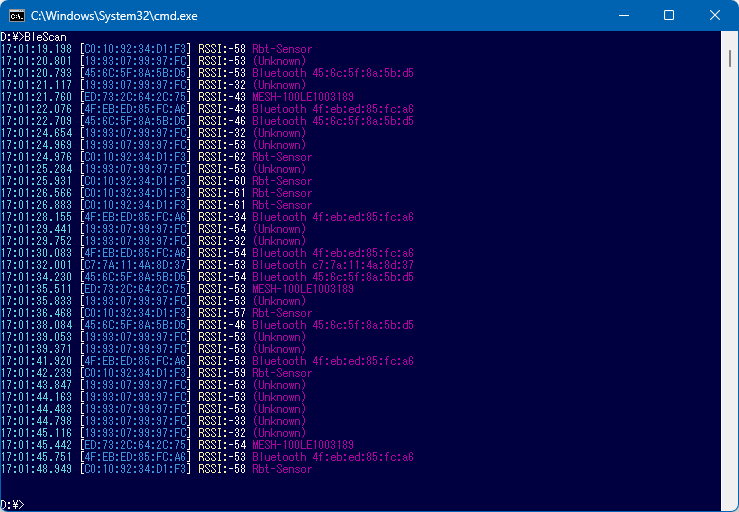
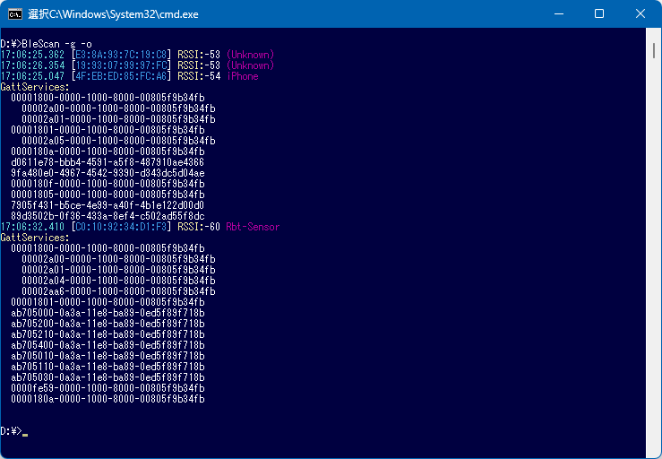
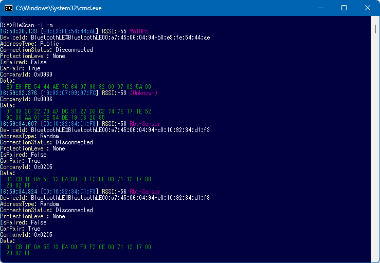

# Bluetooth tool

## BleScan

Bluetooth LE advertisement scanner for Windows.

## Usage

```
blescan [options]
```

| Option | Description |
|:-|:-|
| `--active` / `-a` | Active scanning mode |
| `--once` / `-o` | Show each device only once |
| `--info` / `-i` | Show device information |
| `--gatt` / `-g` | Get GATT services |
| `--manufacturer` / `-m` | Show manufacturer data |
| `--section` / `-s` | Show data sections |

### Examples

```
blescan
blescan -a -o
blescan -a -o -i
blescan -a -o -g
blescan -a -o -m
```




